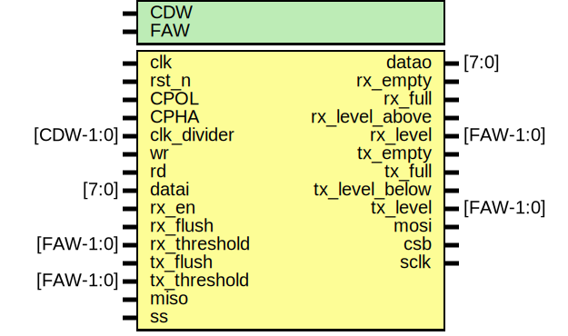

# EF_SPI

SPI master controller with receive and transmit FIFOs.
## The wrapped IP


 APB, AHBL, and Wishbone wrappers are provided. All wrappers provide the same programmer's interface as outlined in the following sections.

#### Wrapped IP System Integration

Based on your use case, use one of the provided wrappers or create a wrapper for your system bus type. For an example of how to integrate the wishbone wrapper:
```verilog
EF_SPI_WB INST (
	.clk_i(clk_i),
	.rst_i(rst_i),
	.adr_i(adr_i),
	.dat_i(dat_i),
	.dat_o(dat_o),
	.sel_i(sel_i),
	.cyc_i(cyc_i),
	.stb_i(stb_i),
	.ack_o(ack_o),
	.we_i(we_i), 
	.IRQ(irq),
	.miso(miso),
	.mosi(mosi),
	.csb(csb),
	.sclk(sclk)
);
```
#### Wrappers with DFT support
Wrappers in the directory ``/hdl/rtl/bus_wrappers/DFT`` have an extra input port ``sc_testmode`` to disable the clock gate whenever the scan chain testmode is enabled.

## Implementation example  

The following table is the result for implementing the EF_SPI IP with different wrappers using Sky130 PDK and [OpenLane2](https://github.com/efabless/openlane2) flow.
|Module | Number of cells | Max. freq |
|---|---|---|
|EF_SPI|TBD| TBD |
|EF_SPI_APB|TBD|TBD|
|EF_SPI_AHBL|TBD|TBD|
|EF_SPI_WB|TBD|TBD|
## The Programmer's Interface


### Registers

|Name|Offset|Reset Value|Access Mode|Description|
|---|---|---|---|---|
|RXDATA|0000|0x00000000|r|RX Data register; the interface to the Receive FIFO.|
|TXDATA|0004|0x00000000|w|TX Data register; ; the interface to the Receive FIFO.|
|CFG|0008|0x00000000|w|Configuration Register.|
|CTRL|000c|0x00000000|w|Control Register.|
|PR|0010|0x00000002|w|SPI clock Prescaler; should have a value >= 2. SPI Clock Frequency = System Clock / PR.|
|STATUS|0014|0x00000000|r|Status resgister|
|RX_FIFO_LEVEL|fe00|0x00000000|r|RX_FIFO Level Register|
|RX_FIFO_THRESHOLD|fe04|0x00000000|w|RX_FIFO Level Threshold Register|
|RX_FIFO_FLUSH|fe08|0x00000000|w|RX_FIFO Flush Register|
|TX_FIFO_LEVEL|fe10|0x00000000|r|TX_FIFO Level Register|
|TX_FIFO_THRESHOLD|fe14|0x00000000|w|TX_FIFO Level Threshold Register|
|TX_FIFO_FLUSH|fe18|0x00000000|w|TX_FIFO Flush Register|
|IM|ff00|0x00000000|w|Interrupt Mask Register; write 1/0 to enable/disable interrupts; check the interrupt flags table for more details|
|RIS|ff08|0x00000000|w|Raw Interrupt Status; reflects the current interrupts status;check the interrupt flags table for more details|
|MIS|ff04|0x00000000|w|Masked Interrupt Status; On a read, this register gives the current masked status value of the corresponding interrupt. A write has no effect; check the interrupt flags table for more details|
|IC|ff0c|0x00000000|w|Interrupt Clear Register; On a write of 1, the corresponding interrupt (both raw interrupt and masked interrupt, if enabled) is cleared; check the interrupt flags table for more details|
|GCLK|ff10|0x00000000|w|Gated clock enable; 1: enable clock, 0: disable clock|

### RXDATA Register [Offset: 0x0, mode: r]

RX Data register; the interface to the Receive FIFO.


### TXDATA Register [Offset: 0x4, mode: w]

TX Data register; ; the interface to the Receive FIFO.


### CFG Register [Offset: 0x8, mode: w]

Configuration Register.


|bit|field name|width|description|
|---|---|---|---|
|0|cpol|1|SPI Clock Polarity.|
|1|cpha|1|SPI Clock Phase.|

### CTRL Register [Offset: 0xc, mode: w]

Control Register.


|bit|field name|width|description|
|---|---|---|---|
|0|SS|1|Slave Select (Active High).|
|1|enable|1|enable spi master pulse generation|
|2|rx_en|1|enable storing bytes recieved from slave|

### PR Register [Offset: 0x10, mode: w]

SPI clock Prescaler; should have a value >= 2. SPI Clock Frequency = System Clock / PR.


### STATUS Register [Offset: 0x14, mode: r]

Status resgister


|bit|field name|width|description|
|---|---|---|---|
|0|TX_E|1|Transmit FIFO is Empty.|
|1|TX_F|1|Transmit FIFO is Full.|
|2|RX_E|1|Receive FIFO is Empty.|
|3|RX_F|1|Receive FIFO is Full.|
|4|TX_B|1|Transmit FIFO level is Below Threshold.|
|5|RX_A|1|Receive FIFO level is Above Threshold.|
|6|busy|1|spi busy flag.|
|7|done|1|spi done flag.|

### RX_FIFO_LEVEL Register [Offset: 0xfe00, mode: r]

RX_FIFO Level Register


|bit|field name|width|description|
|---|---|---|---|
|0|level|4|FIFO data level|

### RX_FIFO_THRESHOLD Register [Offset: 0xfe04, mode: w]

RX_FIFO Level Threshold Register


|bit|field name|width|description|
|---|---|---|---|
|0|threshold|4|FIFO level threshold value|

### RX_FIFO_FLUSH Register [Offset: 0xfe08, mode: w]

RX_FIFO Flush Register


|bit|field name|width|description|
|---|---|---|---|
|0|flush|1|FIFO flush|

### TX_FIFO_LEVEL Register [Offset: 0xfe10, mode: r]

TX_FIFO Level Register


|bit|field name|width|description|
|---|---|---|---|
|0|level|4|FIFO data level|

### TX_FIFO_THRESHOLD Register [Offset: 0xfe14, mode: w]

TX_FIFO Level Threshold Register


|bit|field name|width|description|
|---|---|---|---|
|0|threshold|4|FIFO level threshold value|

### TX_FIFO_FLUSH Register [Offset: 0xfe18, mode: w]

TX_FIFO Flush Register


|bit|field name|width|description|
|---|---|---|---|
|0|flush|1|FIFO flush|

### GCLK Register [Offset: 0xff10, mode: w]

 Gated clock enable register


|bit|field name|width|description|
|---|---|---|---|
|0|gclk_enable|1|Gated clock enable; 1: enable clock, 0: disable clock|


### Interrupt Flags

The wrapped IP provides four registers to deal with interrupts: IM, RIS, MIS and IC. These registers exist for all wrapper types.

Each register has a group of bits for the interrupt sources/flags.
- `IM` [offset: 0xff00]: is used to enable/disable interrupt sources.

- `RIS` [offset: 0xff08]: has the current interrupt status (interrupt flags) whether they are enabled or disabled.

- `MIS` [offset: 0xff04]: is the result of masking (ANDing) RIS by IM.

- `IC` [offset: 0xff0c]: is used to clear an interrupt flag.


The following are the bit definitions for the interrupt registers:

|Bit|Flag|Width|Description|
|---|---|---|---|
|0|TXE|1|Transmit FIFO is Empty.|
|1|TXF|1|Transmit FIFO is Full.|
|2|RXE|1|Receive FIFO is Empty.|
|3|RXF|1|Receive FIFO is Full.|
|4|TXB|1|Transmit FIFO level is Below Threshold.|
|5|RXA|1|Receive FIFO level is Above Threshold.|
### Clock Gating
The IP has clock gating feature, enabling the selective activation and deactivation of the clock as required through the ``GCLK`` register. This functionality is implemented through the ``ef_util_gating_cell``, which is part of the the common modules library, [ef_util_lib.v](https://github.com/efabless/EF_IP_UTIL/blob/main/hdl/ef_util_lib.v). By default, the cell operates with a behavioral implementation, but when the ``CLKG_SKY130_HD`` macro is enabled, the ``sky130_fd_sc_hd__dlclkp_4`` clock gating cell is used.

**Note:** If you choose the [OpenLane2](https://github.com/efabless/openlane2) flow for implementation and would like to add the clock gating feature, you need to add ``CLKG_SKY130_HD`` macro to the ``VERILOG_DEFINES`` configuration variable. Update the YAML configuration file as follows: 
```
VERILOG_DEFINES:
- CLKG_SKY130_HD
```

### The Interface 



#### Module Parameters 

|Parameter|Description|Default Value|
|---|---|---|
|CDW|The width of the clock divider used to generate the SPI clock.|8|
|FAW|Log2 of the FIFO depth.|4|

#### Ports 

|Port|Direction|Width|Description|
|---|---|---|---|
|miso|input|1|SPI Master In Slave Out.|
|mosi|output|1|SPI Master Out Slave In.|
|csb|output|1|Chip/Slave Select (Active Low)|
|sclk|output|1|None|
|CPOL|input|1|SPI Clock Polarity.|
|CPHA|input|1|SPI CLock Phase.|
|clk_divider|input|CDW|The SPI clock divider; SPI clock frequency = System Clock Frequency / clk_divider.|
|wr|input|1|Write to the TX FIFO.|
|rd|input|1|Read from the RX FIFO.|
|datai|input|8|Data to place into the TX FIFO.|
|datao|output|8|Data from the RX FIFO.|
|rx_en|input|1|Enable the RX FIFO.|
|rx_flush|input|1|Flush the RX FIFO.|
|rx_threshold|input|FAW|RX FIFO level threshold.|
|rx_empty|output|1|RX FIFO is empty.|
|rx_full|output|1|RX FIFO is full.|
|rx_level_above|output|1|RX FIFO level is above the threshold.|
|rx_level|output|FAW|RX FIFO data level.|
|tx_flush|input|1|Flush the TX FIFO.|
|tx_threshold|input|FAW|TX FIFO level threshold.|
|tx_empty|output|1|TX FIFO is empty.|
|tx_full|output|1|TX FIFO is full.|
|tx_level_below|output|1|TX FIFO level is below trhe threshold.|
|tx_level|output|FAW|TX FIFO data level.|
|ss|input|1|None|
|enable|input|1|enable for spi master pulse generation|
|done|output|1|spi done flag.|
|busy|output|1|spi busy flag.|
## Firmware Drivers:
Firmware drivers for EF_SPI can be found in the [fw](https://github.com/efabless/EF_SPI/tree/main/fw) directory. EF_SPI driver documentation  is available [here](https://github.com/efabless/EF_SPI/blob/main/fw/README.md).
You can also find an example C application using the EF_SPI drivers [here]().
## Installation:
You can either clone repo or use [IPM](https://github.com/efabless/IPM) which is an open-source IPs Package Manager
* To clone repo:
```git clone https://github.com/efabless/EF_SPI```
> **Note:** If you choose this method, you need to clone [EF_IP_UTIL](https://github.com/efabless/EF_IP_UTIL.git) repository, as it includes required modules from the common modules library, [ef_util_lib.v](https://github.com/efabless/EF_IP_UTIL/blob/main/hdl/ef_util_lib.v)
* To download via IPM , follow installation guides [here](https://github.com/efabless/IPM/blob/main/README.md) then run 
```ipm install EF_SPI```
> **Note:** This method is recommended as it automatically installs [EF_IP_UTIL](https://github.com/efabless/EF_IP_UTIL.git) as a dependency.
